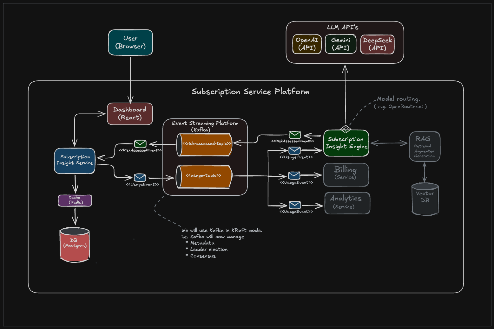

# Subscription Insight Service

A production-style subscription management platform demonstrating event-driven microservices, AI-assisted decision support, and cloud-native deployment patterns for predicting and explaining customer churn risk.

## Architecture



## Start Dependencies
```bash
docker compose up -d
```

## Configure env variables (mac)
```bash
export DB_URL=jdbc:postgresql://localhost:5432/subscriptiondb
export DB_USER=postgres
export DB_PASSWORD=postgres
```

## Start service
```bash
./mvnw spring-boot:run
```