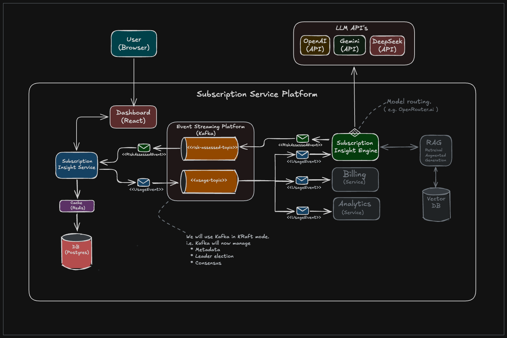

# Subscription Insight Platform

A production-style subscription management platform demonstrating event-driven microservices, AI-assisted decision support, and cloud-native deployment patterns for predicting and explaining customer churn risk.

## Architecture




## Environment Variables

This project requires environment variables to run.

#### 1. Copy the example file:
```bash
   cp .env.example .env
```

#### 2. Add your OpenAI API key to the .env file:
```bash
   OPENAI_API_KEY=your_real_key_here
```

#### 3. Run the platform:
* postgres
* kafka ( in KRaft mode )
* suscription-insight-service
* suscription-insight-engine

```bash
docker compose up --build
```


## Check subscription insight service is up

http://localhost:8080/actuator/health


http://localhost:8080/swagger-ui.html


## Check subscription insight engine is up

http://localhost:8000/docs

## Check engine is talking to LLM

http://localhost:8000/llm-test
